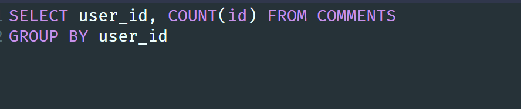
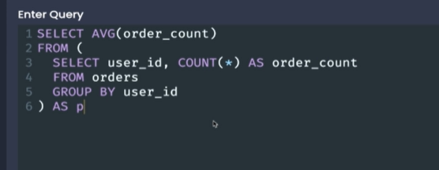

# 24 Jan

## Foregin key constraints around insertion

1. If user id doesn't exist postgresql will throw an error.
   
2. If the user id doesn't exist then we can set it to null
   

## Foregin key constraints around deletion

1. Suppose a user is deleted and it's id is used as foreign key in another table then we do this
   

# 25 Jan

## Testing deletion constraints

1. Setting the on delete cascade
   

2. Now delete the user where id = 1
   

## Setting foreign key to null on delete

1. On delete set the null
   

# 29 Jan

## Queries with joins and aggregations

1. This is our new table structure
   

2. Some intersting questions
   

3. Joins and aggregation
   

## Joining Data from Different Tables

1. Problem
   

2. Problem
   

# 30 Jan

## Alternate form of syntax

1. Notes on join
   

## Missing Data in Joins

1. If we add a record in photo table with user_id as null
2. Then In the join new photo will be not included because it doesn't have corresponding user.
3. But This violates our query requirements

## Why Wasn't it included

1. Explanation is quite simple because we don't find a match that's why it is not included in the output.

# 31 Jan

## Four kind of joins

1. Inner join
   
2. Left outer join
   
3. Right outer join
   
4. Full Join
   

# 3 Feb

## Does order really matter

1. You can clearly see the difference
   

## Where with join

1. Task
   

# 4 Feb

## Three way join

1. Find username, url and comment where user commented on his own photo.

# 5 Feb

## Picturing group by

1. Groupby and aggregation difference
   

2. Here is pictorial representation of groupby
   

3. You can visualize like this
   

4. To select a column in group by query then that colum must be present in group by or aggregate function.

## Aggregate function

1. Here are some examples
   

# 6 Feb

## Combining Group by with aggregates

1. We combine group by with aggregates like this
   

2. You can use this to visualise the internal working of group by
   
3. Null values are not counted in COUNT function
4. To count the all rows including some column has null we can do like this
   

## Visualizing more grouping

1. Here is a problem
   

2. Do all the excercises

- https://www.udemy.com/course/sql-and-postgresql/learn/quiz/4987192#notes

# 7 Feb

## Filtering groups with having

1. Order of important keywords
   
2. Having is only used with group by
3. Problem
   

4. Problem
   

5. Excercise on udemy

# 10 Feb

## Investigating the data set

1. Data now will be related to ecommerce data
   
2. Perform all the excercise

# 12 Feb

## The basics of sorting

1. By default if we order by some value then we go in ascending order
   

2. We can add DESC if we want in desc order

## Two Variations on sorting

1. If price are same for two column we can mention second criteria for sorting that is weight in our case
   

## Offset and limit

1. limit and offset
   

2. Offset example, It just means skip some number of rows from result set.
   

3. Limit example
   

4. Offset with limit example, In this example we are finding the most expensive products except the most expensive one.
   

# 13 Feb

## Handling sets with union

1. Problem
   

## A few notes on union

1. There should be one common column name with same datatype. If both the table has different column name then we can not use union

## Commanalities with intersect

1. Here is diagram for various operations
   

2. Problem: Find the common rows from both the table in previous problem.

## Removing commanalities with except

1. Notes
   

# 14 Feb

## What is subquery

1. Problem
   

# 15 Feb

## Thinking about structure of data

1. Subqueries can be used as
   

# 16 Feb

## Subqueries in select

1. Query must return a single value
2. Here is an example
   

# 18 Feb

## Subqueries in from

1. Continue again

# 22 Feb

## Subqueries in from

1. Initial query
   

2. Subquery in from must have an alias.
3. Basic rule with subqueries in from
   
4. Write the query yourself in above image.

# 6 March

## From subqueries that return a value

1. Final query
   

# 9 March

## Example of sub query in a from

1. Problem
   

2. First use group by to return the each user and their # of order

2. Final result
   
